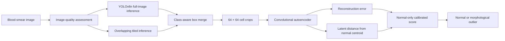

# BPD — Blood Platelet Detection

**BPD** is a local Windows research application for blood-smear cell localization and morphological outlier review. It detects red blood cells, white blood cells, and platelets, then compares each detected crop with a learned normal-cell baseline.

> BPD is a research prototype. Its morphological candidate flags are not a diagnosis and must be reviewed by a qualified professional.

## Install the Windows application

Download [`BPD-Setup-2.2.0.exe`](https://github.com/ritwik1612/BLOOD-PLATELET-DETECTION/releases/download/v2.2.0/BPD-Setup-2.2.0.exe) from the [latest release](https://github.com/ritwik1612/BLOOD-PLATELET-DETECTION/releases/latest).

The installer lets you choose the installation folder and adds **BPD** to Windows Search and the Start menu. The installed program opens in its own desktop window and performs inference locally. It does not require Python, open a browser, show a terminal, or listen on a localhost port.

## Processing pipeline



The current runtime includes:

- YOLOv8n localization for WBC, RBC, and platelet candidates.
- Full-field inference combined with overlapping 640 px tiles for dense or high-resolution smears.
- Class-aware duplicate suppression across tile boundaries.
- A conditional 1024 px retry when stained fields yield too few candidates.
- Low-stain rescue for high-confidence detector candidates.
- Cell-foreground and RBC-cluster guards to reduce invalid anomaly crops.
- A convolutional autoencoder trained with normal cell crops.
- Anomaly scoring from normalized reconstruction error and cosine distance to the class centroid.
- A fixed normal-validation calibration plus a robust image-relative RBC guard.
- Focus, exposure, contrast, and resolution checks before inference.

DMC support remains implemented but disabled in the released configuration because it has not yet shown a reliable improvement on held-out data.

## Data and model boundary

The detector checkpoint is derived from the [TXL-PBC dataset](https://github.com/lugan113/TXL-PBC_Dataset). The anomaly model learns a normal reference from normal WBC, RBC, and platelet crops. Infected images are used for held-out evaluation rather than threshold fitting.

This repository contains the four runtime artifacts needed by the desktop application:

| Artifact | Purpose |
| --- | --- |
| `yolov8n_txl_pbc_best.pt` | YOLOv8n cell localizer |
| `autoencoder_best.pt` | Normal-cell reconstruction model |
| `centroids.pt` | Normal latent-space class centroids |
| `anomaly_calibration.json` | Normal-validation score ranges and threshold |

Training datasets, experiment workspaces, notebooks, and generated evaluation images are intentionally excluded.

## Run from source

Python 3.10 is recommended.

```powershell
git clone https://github.com/ritwik1612/BLOOD-PLATELET-DETECTION.git
cd BLOOD-PLATELET-DETECTION
py -3.10 -m venv .venv
.\.venv\Scripts\python.exe -m pip install --upgrade pip
.\.venv\Scripts\python.exe -m pip install -r requirements.txt
.\.venv\Scripts\python.exe desktop_launcher.py
```

For a non-desktop development run, start `web_app/app.py` and open `http://127.0.0.1:5050`.

## Build the Windows package

```powershell
.\.venv\Scripts\python.exe -m pip install pyinstaller
.\.venv\Scripts\python.exe installer\make_installer_assets.py
.\.venv\Scripts\python.exe -m PyInstaller --noconfirm --clean --distpath dist_desktop --workpath build_desktop BPD.spec
& "$env:LOCALAPPDATA\Programs\Inno Setup 6\ISCC.exe" installer\bpd.iss
```

The installer is written to `installer\release\BPD-Setup-2.2.0.exe`.

## Repository layout

```text
anomaly_detection/     Calibration and anomaly-score logic
configs/               Detector and anomaly runtime settings
feature_extraction/    Autoencoder loading and latent extraction
inference/             Detection, tiling, merge, and scoring pipeline
models/                YOLO and autoencoder definitions
outputs/weights/       Runtime model artifacts
utils/                 Image processing, quality, and visualization helpers
web_app/               Interface and local prediction endpoint
desktop_launcher.py    Native pywebview entry point
BPD.spec               PyInstaller build definition
installer/             Inno Setup definition and branded assets
```

## Result labels

| Label | Meaning |
| --- | --- |
| `WBC`, `RBC`, `PLAT` | Candidate consistent with the learned normal reference |
| `AWBC`, `ARBC`, `APLAT` | Morphological outlier candidate for review |

The original baseline is retained separately in the [`BPD-V1`](https://github.com/ritwik1612/BPD-V1) repository.
